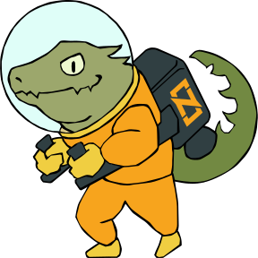

# Official Zig Project Logo

The Zig logo and mascots are licensed under the Attribution-ShareAlike 4.0 International
(CC BY-SA 4.0).

## Main Logo

## Icon

zig-icon.svg is an icon of just the graphical part of the logo.

## Favicon

zig-icon.png is a small version of the icon suitable for a website favicon.

# Official Zig Project Mascots

## Ziguana!

When someone sets up you the bomb, you need a Ziguana.

## Ziggy

Your friendly neighborhood zig mascot.