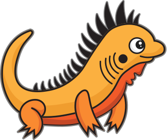

# Official Zig Project Logo

The Zig logo and mascots are licensed under the Attribution-ShareAlike 4.0 International
(CC BY-SA 4.0).

## Main Logo

## Icon

`zig-icon.svg` is an icon of just the graphical part of the logo.

## Favicon

`zig-icon.png` and `logo symbol/zig_FAVICON.svg` is a small version of the icon made for website favicons or sizes smaller than 32×32 px.

# Logo versions

* `full logo/zig_color_dark.svg` is the main logo, preferably used on applicable backgrounds.
* `full logo/zig_color_white.svg` when visibility of the main logotype ("ZIG") is too low.
* `full logo/zig_dark.svg` where color reproduction is not possible, or visibility of colored symbol is too low.
* `full logo/zig_white.svg` where color reproduction is not possible, or visibility of `zig_dark.svg` is too low.
* `logo symbol/zig_FAVICON.svg` and `zig-favicon.png` are slightly modified symbols, with increased margin to be clearer on small sizes.

# Official Mascots

## Zero the Ziguana

## Ziggy the Ziguana

