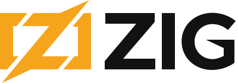
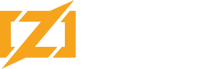
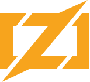

# Official Zig Project Logo

Licensed under the Attribution-ShareAlike 4.0 International (CC BY-SA 4.0).
A different license applies to the mascots.

## Main Logo

The preferred logo, containing both logomark and logotype.

### Dynamic Background

For websites and rendered markdown where the color scheme is not known in
advance, and contains embedded CSS to select the appropriate text color for the
background.

### Light Background

### Dark Background

### Other Versions

 * `zig-logo-neg-black.svg` is for light backgrounds where color reproduction is not
   possible, or visibility of colored symbol is too low.

 * `zig-logo-neg-white.svg` is for dark backgrounds where color reproduction is not
   possible, or visibility of colored symbol is too low.

## Logomark

`zig-mark.svg` is the logomark (icon) alone.

### Other Versions

 * `zig-mark-neg-black.svg` is for light backgrounds where color reproduction is not
   possible, or visibility of colored symbol is too low.

 * `zig-mark-neg-white.svg` is for dark backgrounds where color reproduction is not
   possible, or visibility of colored symbol is too low.

## Favicon

`zig-favicon.png` is a small version of the icon made for website favicons.

# Official Mascots

Licensed under the Attribution 4.0 International (CC BY 4.0).

Mascots are not gendered. Go ahead and adapt them to be masculine, feminine, or
anywhere in between.

## Zero the Ziguana

## Ziggy the Ziguana

## Carmen the Allocgator

